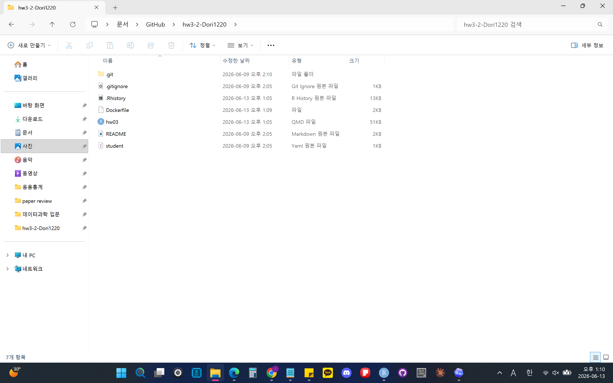
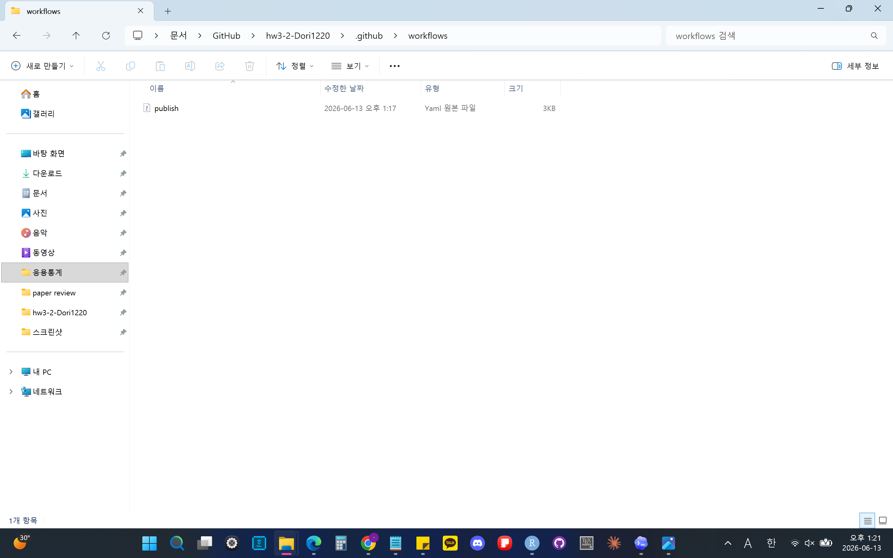
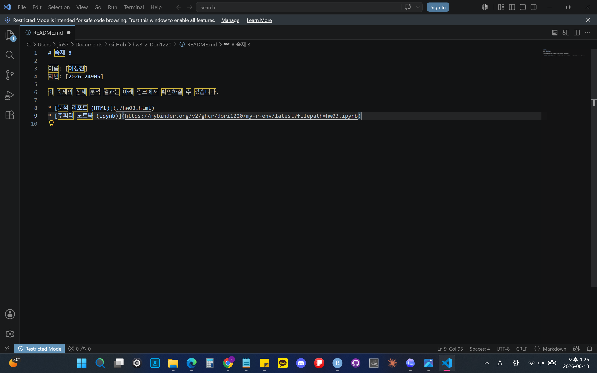
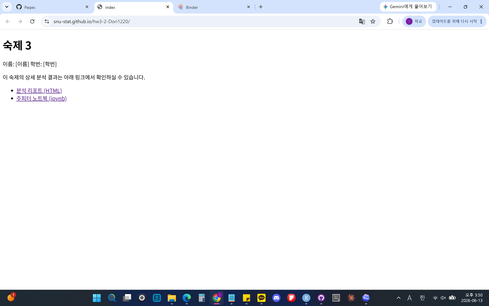

```{r setup, include=FALSE}
knitr::opts_chunk$set(echo = TRUE, eval = TRUE, warning = FALSE, message = FALSE, 
                      fig.width=6, fig.height=4, out.width = "70%", 
                      fig.align = "center", python.reticulate = TRUE)  
options(knitr.table.format = "html")

sys_python <- Sys.getenv("RETICULATE_PYTHON")

if (sys_python != "") {
  # GitHub Actions 환경일 때
  reticulate::use_python(sys_python, required = TRUE)
} else {
  # 내 로컬 컴퓨터 환경일 때
  my_conda <- "C:/Users/jin57/miniconda3/Scripts/conda.exe"
  prof_conda <- "/opt/homebrew/bin/conda"
  
  if (file.exists(my_conda)) {
    reticulate::use_condaenv("introds", conda = my_conda, required = TRUE)
  } else if (file.exists(prof_conda)) {
    reticulate::use_condaenv("introds", conda = prof_conda, required = TRUE)
  }
}
```

## 지시사항

제출마감 2026-06-15 23:00

1.	R과 Python을 모두 사용하여 사용된 코드와 데이터랭글링 절차, 분석결과를 설명한다. 두 언어의 분석결과가 차이가 있으면 그 이유를 설명한다.
2.  [Quarto Markdown](https://quarto.org/docs/authoring/markdown-basics.html)을 사용한다. 제공된 숙제 `.qmd` 파일에 본인의 답안을 "답안" 절에 추가하여 제출한다. Quarto Markdown은 RStudio 또는 Visual Studio Code에 [Quarto Extension](https://marketplace.visualstudio.com/items?itemName=quarto.quarto)을 추가하여 컴파일, 다른 문서 형식으로 변환할 수 있다. 
3.  R의 `reticulate` 패키지를 사용하면 하나의 `.qmd` 파일 안에서 R과 Python을 동시에 사용할 수 있다. 이때 다음 문법을 사용하여 두 언어 코드를 탭으로 구분한다.  숙제 `.qmd` 파일은 `reticulate`을 사용하도록 준비되어 있다.

````
::: {.panel-tabset}

## R

```{{r}}
R code
```

## Python

```{{python}}
Python code
```

:::

````

3.  `.qmd`를 컴파일하여 생성된 `.html` 파일을 함께 저장소에 제출한다.
4.  함께 제공된 `student.yml`을 함께 작성하여 저장소에 제출한다.

## 평가 기준

1.  재현성: 제출된 저장소의 `.qmd` 파일을 컴파일하여 함께 제출된 `.html` 파일과 동일한 결과가 나와야 한다.
2.	분석의 정확성: 분석은 올바른 기술적 세부 사항을 포함하여 수행되어야 한다.
3.	보고서의 전반적인 품질: 데이터 가공 및 분석 결과가 명확하고 자세하게 설명되어야 한다.
4.	코드의 전반적인 품질: 코드는 체계적으로 정리되어 있어야 하며, 가독성을 높이기 위해 적절한 주석이 포함되어야 한다.

#### **늦게 제출된 과제물은 받지 않는다.**

## 필요 패키지 로드

::: {.panel-tabset}

## R

```{r}
library(tidyverse)
library(NHANES)
library(broom)
library(Lahman)
library(MASS)
```

## Python

```{python}
import numpy as np
import pandas as pd
import statsmodels.api as sm
import statsmodels.formula.api as smf
from scipy.stats import chi2
from statsmodels.datasets import get_rdataset
import pylahman
from scipy.optimize import curve_fit
from scipy.stats import t
import statsmodels.api as sm
import matplotlib.pyplot as plt
```

:::


# 1부  교과서 연습문제

## 문제 1-1

1. MDSR 10장 연습문제 10.6.6

### 답안

::: {.panel-tabset}

## R

```{r}
# 1. 20세 이상 + 현재 흡연 여부 재코딩
nhanes_smoke <- NHANES %>%
  filter(Age >= 20) %>%
  mutate(
    CurrentSmoke = case_when(
      Smoke100 == "No" ~ 0,
      Smoke100 == "Yes" & SmokeNow == "Yes" ~ 1,
      Smoke100 == "Yes" & SmokeNow == "No" ~ 0,
      TRUE ~ NA_real_
    )
  )

# 재코딩 확인
table(nhanes_smoke$CurrentSmoke, useNA = "ifany")

# 2. 분석에 사용할 변수 선택
model_data <- nhanes_smoke %>%
  dplyr::select(
    CurrentSmoke,
    Age, Gender, Race1, Education, MaritalStatus,
    Poverty, BMI, HealthGen, PhysActive
  ) %>%
  drop_na()

# 3. 로지스틱 회귀모형
smoke_fit <- glm(
  CurrentSmoke ~ Age + Gender + Race1 + Education + MaritalStatus +
    Poverty + BMI + HealthGen + PhysActive,
  data = model_data,
  family = binomial
)

summary(smoke_fit)

# 4. Odds Ratio와 95% CI 보기
tidy(smoke_fit, exponentiate = TRUE, conf.int = TRUE) %>%
  mutate(across(where(is.numeric), round, 3))

# 5. 각 predictor의 전체 유의성 검정
drop1(smoke_fit, test = "Chisq")
```

## Python

```{python}
NHANES = r.NHANES

# 1. 20세 이상 + CurrentSmoke 재코딩
nhanes_smoke = NHANES.query("Age >= 20").copy()

nhanes_smoke["CurrentSmoke"] = np.select(
    [
        nhanes_smoke["Smoke100"] == "No",
        (nhanes_smoke["Smoke100"] == "Yes") & (nhanes_smoke["SmokeNow"] == "Yes"),
        (nhanes_smoke["Smoke100"] == "Yes") & (nhanes_smoke["SmokeNow"] == "No")
    ],
    [0, 1, 0],
    default=np.nan
)

# 2. 분석에 사용할 변수 선택 + 결측 제거
vars_used = [
    "CurrentSmoke",
    "Age", "Gender", "Race1", "Education", "MaritalStatus",
    "Poverty", "BMI", "HealthGen", "PhysActive"
]

model_data = nhanes_smoke[vars_used].dropna().copy()

# 3. 기준범주 맞추기
model_data["Gender"] = pd.Categorical(
    model_data["Gender"],
    categories=["female", "male"]
)

model_data["Race1"] = pd.Categorical(
    model_data["Race1"],
    categories=["Black", "Hispanic", "Mexican", "White", "Other"]
)

model_data["Education"] = pd.Categorical(
    model_data["Education"],
    categories=["8th Grade", "9 - 11th Grade", "High School",
                "Some College", "College Grad"]
)

model_data["MaritalStatus"] = pd.Categorical(
    model_data["MaritalStatus"],
    categories=["Divorced", "LivePartner", "Married",
                "NeverMarried", "Separated", "Widowed"]
)

model_data["HealthGen"] = pd.Categorical(
    model_data["HealthGen"],
    categories=["Excellent", "Vgood", "Good", "Fair", "Poor"]
)

model_data["PhysActive"] = pd.Categorical(
    model_data["PhysActive"],
    categories=["No", "Yes"]
)

# 4. Logistic regression
formula = """
CurrentSmoke ~ Age + C(Gender) + C(Race1) + C(Education)
+ C(MaritalStatus) + Poverty + BMI + C(HealthGen) + C(PhysActive)
"""

smoke_fit = smf.glm(
    formula=formula,
    data=model_data,
    family=sm.families.Binomial()
).fit()

print(smoke_fit.summary())
```

:::

현재 흡연 여부를 종속변수로 한 로지스틱 회귀분석 결과, 대부분의 변수들이 현재 흡연과 유의한 관련이 있었다. 전체 변수 단위의 검정인 drop1() 결과에서도 Age, Gender, Race1, Education, MaritalStatus, Poverty, BMI, HealthGen, PhysActive 모두 유의하였다.


# 2부  데이터 분석 실무

### 분석 관련 공통 지침

1.	관측단위(observational unit)는 `playerID`와 `yearID`의 고유한 조합으로 한다. 즉, 데이터프레임의 각 행은 한 선수의 특정 연도에 해당해야 하고(예: 2019년 류현진), 한 선수의 특정 연도가 두 번 이상 나타나서는 안 된다. 이적을 한 경우 원자료에서는 두 번 이상 나타날 수 있으므로 주의해야 한다.
2.	데이터 분석을 하는 중에 필요한 경우 pivoting으로 각 행이 한명의 선수에 해당하는 wide format data를 만들어서 연도간 비교를 하는 것은 허용한다.


## 문제 2-1

Lahman Package의 `Teams` 데이터프레임에서 코로나 시즌인 2020년을 제외한 2010년부터 2025년 사이의 데이터를 이용하여 다음 질문에 답하라. 

1.  MDSR Chapter 7 Iteration 에서 배운 Bill James의 공식을 변형한 다음 모형을 데이터에 적합하고, 모수 $k$의 점추정치와 신뢰구간을 구하라.
$$
  WPct = \frac{RS^k}{S^k+RA^k} = \frac{1}{1+(RA/RS)^k}
$$

### 답안

::: {.panel-tabset}

## R

```{r}
# 0. 데이터 전처리

teams_dat <- Teams %>%
  filter(yearID >= 2010, yearID <= 2025, yearID != 2020) %>%
  transmute(
    yearID,
    lgID,
    teamID,
    name,
    W,
    L,
    G = W + L,
    RS = R,
    RA = RA,
    WPct = W / (W + L)
  ) %>%
  filter(
    !is.na(WPct),
    !is.na(RS),
    !is.na(RA),
    RS > 0,
    RA > 0,
    G > 0
  ) %>%
  mutate(
    log_RS_RA = log(RS / RA),
    log_RS = log(RS),
    log_RA = log(RA)
  )

# 1. Bill James 공식 변형 모형
bj_fit <- nls(
  WPct ~ 1 / (1 + (RA / RS)^k),
  data = teams_dat,
  start = list(k = 2),
  weights = G
)

summary(bj_fit)

# 2. k의 점추정치와 신뢰구간
k_est <- coef(bj_fit)["k"]

k_ci <- confint.default(bj_fit)

tibble(
  term = "k",
  estimate = k_est,
  conf.low = k_ci["k", 1],
  conf.high = k_ci["k", 2]
)
```

## Python

```{python}
Teams = pylahman.Teams()
teams_dat = (
    Teams
    .query("2010 <= yearID <= 2025 and yearID != 2020")
    .assign(
        G=lambda d: d["W"] + d["L"],
        RS=lambda d: d["R"],
        WPct=lambda d: d["W"] / (d["W"] + d["L"])
    )
    .loc[:, ["yearID", "lgID", "teamID", "name", "W", "L", "G", "RS", "RA", "WPct"]]
    .dropna()
    .query("RS > 0 and RA > 0 and G > 0")
    .assign(
        log_RS_RA=lambda d: np.log(d["RS"] / d["RA"]),
        log_RS=lambda d: np.log(d["RS"]),
        log_RA=lambda d: np.log(d["RA"])
    )
)

def bill_james_model(x, k):
    RS, RA = x
    return 1 / (1 + (RA / RS) ** k)
  
popt, pcov = curve_fit(
    bill_james_model,
    xdata=(teams_dat["RS"].to_numpy(), teams_dat["RA"].to_numpy()),
    ydata=teams_dat["WPct"].to_numpy(),
    p0=[2],
    sigma=1 / np.sqrt(teams_dat["G"].to_numpy()),
    absolute_sigma=False
)

k_est = popt[0]
k_se = np.sqrt(pcov[0, 0])
df = len(teams_dat) - 1
k_ci = (
    k_est - t.ppf(0.975, df) * k_se,
    k_est + t.ppf(0.975, df) * k_se
)

print("Bill James nls result")
print(f"k estimate: {k_est:.4f}")
print(f"95% CI: ({k_ci[0]:.4f}, {k_ci[1]:.4f})")
```

:::

2.  회귀계수 $\beta_1$이 위 모형의 $k$와 거의 같은 의미를 가지는 로지스틱 회귀 모형을 세우고 이를 데이터에 적합하라. 모수와 점추정치와 신뢰구간을 구하고 이를 1항의 결과와 비교하라. 

    *주의*: 절편이 없는 모형을 적합해야 함.
    *힌트 1*. 로짓은 $\log〖WPct/(1-WPct)$로 계산됨.
    *힌트 2*. 로짓의 역함수인 sigmoid는 $\frac{1}{1+e^{-x}}$로 계산됨.

### 답안

::: {.panel-tabset}

## R

```{r}
# 절편 없는 로지스틱 회귀모형
glm_k_fit <- glm(
  cbind(W, L) ~ 0 + log_RS_RA,
  data = teams_dat,
  family = binomial
)

summary(glm_k_fit)

# 회귀계수 beta1의 점추정치와 신뢰구간
beta1_est <- coef(glm_k_fit)["log_RS_RA"]
beta1_ci <- confint.default(glm_k_fit)

tibble(
  term = "beta1",
  estimate = beta1_est,
  conf.low = beta1_ci["log_RS_RA", 1],
  conf.high = beta1_ci["log_RS_RA", 2]
)

# 비교
bind_rows(
  tibble(
    model = "Bill James nls",
    term = "k",
    estimate = k_est,
    conf.low = k_ci["k", 1],
    conf.high = k_ci["k", 2]
  ),
  tibble(
    model = "No-intercept logistic glm",
    term = "beta1",
    estimate = beta1_est,
    conf.low = beta1_ci["log_RS_RA", 1],
    conf.high = beta1_ci["log_RS_RA", 2]
  )
)
```

## Python

```{python}
# logit(WPct) = beta1 * log(RS / RA)
num_cols = ["W", "L", "G", "RS", "RA", "WPct", "log_RS_RA", "log_RS", "log_RA"]

teams_dat[num_cols] = teams_dat[num_cols].apply(
    pd.to_numeric,
    errors="coerce"
)

teams_dat = teams_dat.dropna(subset=num_cols).copy()

# 반응변수: R의 cbind(W, L)에 해당
y = teams_dat[["W", "L"]].astype(float)

# 설명변수: 절편 없이 log_RS_RA만 포함
X_k = teams_dat[["log_RS_RA"]].astype(float)

glm_k_fit = sm.GLM(
    y,
    X_k,
    family=sm.families.Binomial()
).fit()

print(glm_k_fit.summary())

beta1_est = glm_k_fit.params["log_RS_RA"]
beta1_ci = glm_k_fit.conf_int().loc["log_RS_RA"]

print("\nComparison with Problem 1")
print(f"Bill James k: {k_est:.4f}")
print(f"Logistic beta1: {beta1_est:.4f}")
print(f"beta1 95% CI: ({beta1_ci[0]:.4f}, {beta1_ci[1]:.4f})")
```

:::

1번의 nls 모형과 2번의 glm 모형은 수학적으로 매우 비슷한 형태를 가진다.
다만 nls는 승률의 예측오차를 최소화하는 방식이고, glm은 승패를 이항분포로 보고 likelihood를 최대화하는 방식이다.
따라서 추정치가 완전히 같지는 않으나, 비슷한 값이 나온 것을 확인해 (두 추정치 모두 1.75에 가깝다) 두 접근법이 같은 실질적 결론을 준다고 해석할 수 있다.


3.  2항의 모형 적합 결과에 대한 다음 세가지 진단 중 최소 두가지 이상을 수행하여 모형적합이 잘 되었는지 확인하라.

    i.  Residual Deviance에 대한 해석 (카이제곱 분포와 비교) 
	  ii. Deviance residuals vs linear predictors ($\eta$) 산점도 
	  iii.  관측된 WPct와 모형에서 예측하는 WPct를 산점도 그래프로 비교

### 답안

::: {.panel-tabset}

## R

```{r}
# 모형진단
diag_dat <- teams_dat %>%
  mutate(
    eta = predict(glm_k_fit, type = "link"),
    pred_WPct = predict(glm_k_fit, type = "response"),
    dev_resid = residuals(glm_k_fit, type = "deviance")
  )

ggplot(diag_dat, aes(x = eta, y = dev_resid)) +
  geom_point(alpha = 0.7) +
  geom_hline(yintercept = 0, linetype = "dashed") +
  labs(
    x = "Linear predictor eta",
    y = "Deviance residual",
    title = "Deviance residuals vs linear predictors"
  ) +
  theme_minimal()

ggplot(diag_dat, aes(x = pred_WPct, y = WPct)) +
  geom_point(alpha = 0.7) +
  geom_abline(intercept = 0, slope = 1, color = "red") +
  labs(
    x = "Predicted WPct",
    y = "Observed WPct",
    title = "Observed vs predicted winning percentage"
  ) +
  theme_minimal()
```

## Python

```{python}
# 모형 진단
diag_dat = teams_dat.copy()
diag_dat["eta"] = np.dot(X_k, glm_k_fit.params)
diag_dat["pred_WPct"] = glm_k_fit.predict(X_k)
diag_dat["dev_resid"] = glm_k_fit.resid_deviance

# ii. Deviance residuals vs linear predictors
plt.figure(figsize=(7, 5))
plt.scatter(diag_dat["eta"], diag_dat["dev_resid"], alpha=0.7)
plt.axhline(0, linestyle="--", color="black")
plt.xlabel("Linear predictor eta")
plt.ylabel("Deviance residual")
plt.title("Deviance residuals vs linear predictors")
plt.show()

# iii. Observed WPct vs predicted WPct
plt.figure(figsize=(6, 6))
plt.scatter(diag_dat["pred_WPct"], diag_dat["WPct"], alpha=0.7)
plt.plot([0, 1], [0, 1], color="red")
plt.xlabel("Predicted WPct")
plt.ylabel("Observed WPct")
plt.title("Observed vs predicted winning percentage")
plt.xlim(0.25, 0.75)
plt.ylim(0.25, 0.75)
plt.show()
```

:::

Deviance residuals vs linear predictors 산점도의 경우 산점도점들이 0을 중심으로 특별한 곡선 패턴 없이 흩어져 있으면 모형이 비교적 적절하다고 볼 수 있다.

또한 관측된 WPct와 모형에서 예측하는 WPct를 산점도 그래프는 모형이 예측한 승률과 실제 승률을 비교한다. 점들이 y=x 근처에 모여 있으면 예측이 실제 승률과 잘 맞는다는 뜻으로, 대체로 적합이 잘 되었음을 확인할 수 있다.

4.  `WPct`를 반응변수로, `log(RA)`와 `log(RS)`를 설명변수로 하는 절편이 없는 로지스틱선형회귀 모형을 적합하고 회귀계수들의 추정 결과를 a와 b항의 결과와 비교하라. (유사한 모형을 얻는지 여부 등)


### 답안

::: {.panel-tabset}

## R

```{r}
glm_ab_fit <- glm(
  cbind(W, L) ~ 0 + log_RS + log_RA,
  data = teams_dat,
  family = binomial
)

summary(glm_ab_fit)

ab_ci <- confint.default(glm_ab_fit)

tibble(
  term = names(coef(glm_ab_fit)),
  estimate = coef(glm_ab_fit),
  conf.low = ab_ci[, 1],
  conf.high = ab_ci[, 2]
)

compare_coef <- tibble(
  quantity = c(
    "nls k",
    "glm beta1",
    "a: coefficient of log(RS)",
    "-b: negative coefficient of log(RA)",
    "a + b"
  ),
  estimate = c(
    k_est,
    beta1_est,
    coef(glm_ab_fit)["log_RS"],
    -coef(glm_ab_fit)["log_RA"],
    coef(glm_ab_fit)["log_RS"] + coef(glm_ab_fit)["log_RA"]
  )
)

compare_coef

anova(glm_k_fit, glm_ab_fit, test = "Chisq")

AIC(glm_k_fit, glm_ab_fit)
```

## Python

```{python}
# 절편 없는 로지스틱 회귀

num_cols = ["W", "L", "G", "RS", "RA", "WPct", "log_RS_RA", "log_RS", "log_RA"]

teams_dat[num_cols] = teams_dat[num_cols].apply(
    pd.to_numeric,
    errors="coerce"
)

teams_dat = teams_dat.dropna(subset=num_cols).copy()

y = teams_dat[["W", "L"]].astype("float64")
X_ab = teams_dat[["log_RS", "log_RA"]].astype("float64")

glm_ab_fit = sm.GLM(
    y,
    X_ab,
    family=sm.families.Binomial()
).fit()

print(glm_ab_fit.summary())

a_est = glm_ab_fit.params["log_RS"]
b_est = glm_ab_fit.params["log_RA"]

compare_table = pd.DataFrame({
    "quantity": [
        "Bill James nls k",
        "log(RS/RA) glm beta1",
        "a = coefficient of log(RS)",
        "b = coefficient of log(RA)",
        "-b"
    ],
    "estimate": [
        k_est,
        beta1_est,
        a_est,
        b_est,
        -b_est
    ]
})

print(compare_table)

# 2번 모형과 4번 모형의 적합도 비교
lrt = glm_k_fit.deviance - glm_ab_fit.deviance
df_diff = glm_k_fit.df_resid - glm_ab_fit.df_resid
lrt_p = chi2.sf(lrt, df_diff)

print("\nModel comparison")
print(f"AIC of log(RS/RA) model: {glm_k_fit.aic:.4f}")
print(f"AIC of log(RS), log(RA) model: {glm_ab_fit.aic:.4f}")
print(f"LRT statistic: {lrt:.4f}")
print(f"df difference: {df_diff:.0f}")
print(f"LRT p-value: {lrt_p:.4f}")
```

:::

이 모형은 log(RS / RA)를 하나의 변수로 넣는 대신, log(RS)와 log(RA)를 따로 넣은 모형이다.

4번 모형에서 log(RS)의 회귀계수 a는 1.75, log(RA)의 회귀계수 b는 -1.75로 추정되었다. 이는 1번의 Bill James 모형에서 추정된 k = 1.75 및 2번의 log(RS/RA) 로지스틱 회귀모형의 beta1 = 1.75와 거의 동일하다.

Bill James 모형은 로짓 형태로 쓰면 logit(WPct) = k log(RS) - k log(RA)이므로, log(RS)의 계수는 k, log(RA)의 계수는 -k가 된다. 실제 분석 결과에서도 a = 1.75, b = -1.75로 나타났으므로 4번의 절편 없는 로지스틱 회귀모형은 Bill James 모형과 유사한 모형을 얻었다고 볼 수 있다.

즉, 득점이 증가하면 승률은 증가하고 실점이 증가하면 승률은 감소하며, 두 효과의 크기는 거의 대칭적이다.


## 문제 2-2

`WPct`를 반응변수로, `logRS`, `logRA`, `H`, `X2B`, `X3B`, `HR`, `BB`, `SO`, `CS`, `HBP`, `SF`, `ERA`, `CG`, `SHO`, `IPouts`, `HA`, `HRA`, `BBA`, `SOA`, `E`, `DP`, `FP`, `SV`를 설명변수로 하는 절편항이 있는 로지스틱 회귀 모형을 적합하고 AIC를 기준으로 하는 단계별(stepwise) 변수선택을 적용하라. 변수선택 후 남은 변수들을 모두 모형에 남길지 일부를 제거할지 다시 판단하라. 최종적으로 선택된 모형을 문제1의 모형과 비교하라. 

### 답안

::: {.panel-tabset}

## R

```{r}
# 1. 데이터 준비

vars_22 <- c(
  "H", "X2B", "X3B", "HR", "BB", "SO", "CS", "HBP", "SF",
  "ERA", "CG", "SHO", "IPouts", "HA", "HRA", "BBA", "SOA",
  "E", "DP", "FP", "SV"
)

teams22 <- Teams %>%
  filter(yearID >= 2010, yearID <= 2025, yearID != 2020) %>%
  mutate(
    G = W + L,
    WPct = W / (W + L),
    logRS = log(R),
    logRA = log(RA),
    logRSRA = log(R / RA)
  ) %>%
  dplyr::select(
    yearID, lgID, teamID, name,
    W, L, G, WPct, logRSRA, logRS, logRA,
    all_of(vars_22)
  ) %>%
  mutate(
    across(
      c(W, L, G, WPct, logRSRA, logRS, logRA, all_of(vars_22)),
      as.numeric
    )
  ) %>%
  drop_na() %>%
  filter(G > 0)

# 관측단위 중복 확인
teams22 %>%
  count(yearID, teamID, lgID) %>%
  filter(n > 1)

# 2. 절편 있는 full logistic model

full_formula <- as.formula(
  paste(
    "cbind(W, L) ~",
    paste(c("logRS", "logRA", vars_22), collapse = " + ")
  )
)

full_fit <- glm(
  full_formula,
  data = teams22,
  family = binomial
)

summary(full_fit)
AIC(full_fit)

# 3. AIC 기준 stepwise variable selection

step_fit <- step(
  full_fit,
  direction = "both",
  trace = 1
)

summary(step_fit)
AIC(full_fit, step_fit)

# 선택된 변수 확인
names(coef(step_fit))

# 4. 선택 후 남은 변수들을 계속 남길지 판단

drop1_result <- drop1(step_fit, test = "Chisq")
drop1_result

# AIC 기준으로 정렬해서 보기
drop1_result %>%
  as.data.frame() %>%
  rownames_to_column("term") %>%
  arrange(AIC)

# 기본적으로 final_fit은 stepwise 결과로 둔다.

final_fit <- step_fit

# 5. 문제 2-1의 모형과 비교

problem1_fit <- glm(
  cbind(W, L) ~ 0 + logRSRA,
  data = teams22,
  family = binomial
)

compare_models <- tibble(
  model = c(
    "Problem 2-1: no-intercept log(RS/RA)",
    "Problem 2-2: full model",
    "Problem 2-2: stepwise/final model"
  ),
  AIC = c(
    AIC(problem1_fit),
    AIC(full_fit),
    AIC(final_fit)
  ),
  deviance = c(
    deviance(problem1_fit),
    deviance(full_fit),
    deviance(final_fit)
  ),
  df_residual = c(
    df.residual(problem1_fit),
    df.residual(full_fit),
    df.residual(final_fit)
  )
)

compare_models
```

## Python

```{python}
# 1. 데이터 준비

Teams = pylahman.Teams()
Teams = Teams.rename(columns={"2B": "X2B", "3B": "X3B"})
vars_22 = [
    "H", "X2B", "X3B", "HR", "BB", "SO", "CS", "HBP", "SF",
    "ERA", "CG", "SHO", "IPouts", "HA", "HRA", "BBA", "SOA",
    "E", "DP", "FP", "SV"
]

needed = ["yearID", "W", "L", "R", "RA"] + vars_22

Teams[needed] = Teams[needed].apply(
    pd.to_numeric,
    errors="coerce"
)

teams22 = Teams.loc[
    (Teams["yearID"] >= 2010)
    & (Teams["yearID"] <= 2025)
    & (Teams["yearID"] != 2020)
].copy()

teams22["G"] = teams22["W"] + teams22["L"]
teams22["WPct"] = teams22["W"] / teams22["G"]
teams22["logRS"] = np.log(teams22["R"])
teams22["logRA"] = np.log(teams22["RA"])
teams22["logRSRA"] = np.log(teams22["R"] / teams22["RA"])

keep_cols = [
    "yearID", "lgID", "teamID", "name",
    "W", "L", "G", "WPct", "logRSRA", "logRS", "logRA"
] + vars_22

teams22 = (
    teams22[keep_cols]
    .dropna()
    .query("G > 0")
    .copy()
)

# 2. 절편 있는 full logistic model

model_terms = ["logRS", "logRA"] + vars_22

y = teams22[["W", "L"]].astype("float64")

def fit_glm(terms):
    X = teams22[terms].astype("float64")
    X = sm.add_constant(X, has_constant="add")
    return sm.GLM(y, X, family=sm.families.Binomial()).fit()

full_fit = fit_glm(model_terms)

print(full_fit.summary())
print("Full model AIC:", full_fit.aic)

# 3. AIC 기준 stepwise variable selection

def stepwise_aic(all_terms, start_terms=None, verbose=True, tol=1e-7):
    included = list(all_terms if start_terms is None else start_terms)

    best_fit = fit_glm(included)
    best_aic = best_fit.aic

    while True:
        candidates = []

        # drop step
        for term in included:
            new_terms = [t for t in included if t != term]
            fit = fit_glm(new_terms)
            candidates.append(("drop", term, new_terms, fit.aic, fit))

        # add step
        excluded = [t for t in all_terms if t not in included]
        for term in excluded:
            new_terms = included + [term]
            fit = fit_glm(new_terms)
            candidates.append(("add", term, new_terms, fit.aic, fit))

        if not candidates:
            break

        action, term, new_terms, new_aic, new_fit = min(
            candidates,
            key=lambda x: x[3]
        )

        if new_aic < best_aic - tol:
            included = new_terms
            best_aic = new_aic
            best_fit = new_fit

            if verbose:
                print(f"{action:4s} {term:8s} AIC = {best_aic:.4f}")
        else:
            break

    return included, best_fit

selected_terms, step_fit = stepwise_aic(
    model_terms,
    start_terms=model_terms,
    verbose=True
)

print("\nSelected terms:")
print(selected_terms)

print(step_fit.summary())
print("Stepwise model AIC:", step_fit.aic)

# 4. 선택 후 남은 변수들을 계속 남길지 판단

def drop1_table(terms):
    full = fit_glm(terms)
    rows = [{
        "term": "<none>",
        "Df": np.nan,
        "Deviance": full.deviance,
        "AIC": full.aic,
        "LRT": np.nan,
        "Pr(>Chi)": np.nan
    }]

    for term in terms:
        reduced_terms = [t for t in terms if t != term]
        reduced = fit_glm(reduced_terms)

        lrt = reduced.deviance - full.deviance
        df = reduced.df_resid - full.df_resid
        p_value = chi2.sf(lrt, df)

        rows.append({
            "term": term,
            "Df": df,
            "Deviance": reduced.deviance,
            "AIC": reduced.aic,
            "LRT": lrt,
            "Pr(>Chi)": p_value
        })

    return pd.DataFrame(rows).sort_values("AIC")

drop1_result = drop1_table(selected_terms)
print(drop1_result)

# 기본적으로 final model은 stepwise 결과로 둔다.
final_terms = selected_terms
final_fit = step_fit

# 5. 문제 2-1의 모형과 비교

# 문제 2-1 모형: 절편 없는 log(RS/RA) 모형
X_problem1 = teams22[["logRSRA"]].astype("float64")

problem1_fit = sm.GLM(
    y,
    X_problem1,
    family=sm.families.Binomial()
).fit()

compare_models = pd.DataFrame({
    "model": [
        "Problem 2-1: no-intercept log(RS/RA)",
        "Problem 2-2: full model",
        "Problem 2-2: stepwise/final model"
    ],
    "AIC": [
        problem1_fit.aic,
        full_fit.aic,
        final_fit.aic
    ],
    "deviance": [
        problem1_fit.deviance,
        full_fit.deviance,
        final_fit.deviance
    ],
    "df_residual": [
        problem1_fit.df_resid,
        full_fit.df_resid,
        final_fit.df_resid
    ]
})

print(compare_models)
```

:::

full model은 logRS, logRA와 팀의 타격, 투구, 수비 지표를 모두 포함한 절편 있는 로지스틱 회귀모형이다.

stepwise selection을 통해 AIC를 기준으로 변수를 제거하거나 추가하면서 더 낮은 AIC를 갖는 모형을 도출했다. stepwise 이후 drop1 결과를 보면, 선택된 각 변수를 하나씩 제거했을 때 AIC와 deviance가 어떻게 변하는지 확인할 수 있는데 <none>의 AIC가 가장 작으므로 추가적인 변수 제거 없이 변수를 유지하는 것이 적절하다.

최종 모형의 AIC가 문제 2-1의 단순한 log(RS/RA) 모형보다 낮기 때문에, 추가적인 타격, 투구, 수비 변수들이 승률 설명에 도움을 준다고 볼 수 있다. 다만 문제 2-1 모형은 매우 단순하고 해석이 쉬운 반면, 문제 2-2 모형은 예측력은 높을 수 있지만 더 복잡하다.

## 문제 2-3

1.  `W`(승리 횟수)를 반응변수로 하여 문제 2-2의 분석을 실시하되 포아송 회귀모형을 사용하라. 결과를 문제 2-2의 모형과 비교하라. 

2.  `W`를 반응변수로 하여 문제2의 분석을 실시하되 음이항 회귀모형을 사용하라. 모형 적합 시 오류가 발생하면 이유를 파악해서 보고하라.

### 답안

::: {.panel-tabset}

## R

```{r}
# 데이터 준비
vars_23 <- c(
  "logRS", "logRA",
  "H", "X2B", "X3B", "HR", "BB", "SO", "CS", "HBP", "SF",
  "ERA", "CG", "SHO", "IPouts", "HA", "HRA", "BBA", "SOA",
  "E", "DP", "FP", "SV"
)

teams23 <- Teams %>%
  filter(yearID >= 2010, yearID <= 2025, yearID != 2020) %>%
  mutate(
    G = W + L,
    WPct = W / G,
    logRS = log(R),
    logRA = log(RA),
    logRSRA = log(R / RA)
  ) %>%
  dplyr::select(
    yearID, lgID, teamID, name,
    W, L, G, WPct, logRSRA,
    all_of(vars_23)
  ) %>%
  mutate(across(c(W, L, G, WPct, logRSRA, all_of(vars_23)), as.numeric)) %>%
  drop_na() %>%
  filter(G > 0)

# 문제 2-2와 비교하기 위한 binomial stepwise model
binom_full <- glm(
  cbind(W, L) ~ logRS + logRA + H + X2B + X3B + HR + BB + SO + CS + HBP + SF +
    ERA + CG + SHO + IPouts + HA + HRA + BBA + SOA + E + DP + FP + SV,
  data = teams23,
  family = binomial
)

binom_step <- step(binom_full, direction = "both", trace = 0)

# 1. Poisson regression: W를 반응변수로 사용
pois_full <- glm(
  W ~ logRS + logRA + H + X2B + X3B + HR + BB + SO + CS + HBP + SF +
    ERA + CG + SHO + IPouts + HA + HRA + BBA + SOA + E + DP + FP + SV +
    offset(log(G)),
  data = teams23,
  family = poisson
)

pois_step <- step(pois_full, direction = "both", trace = 1)

summary(pois_step)
drop1(pois_step, test = "Chisq")

# Poisson 과산포 확인
pois_dispersion <- sum(residuals(pois_step, type = "pearson")^2) / df.residual(pois_step)
pois_dispersion

# 문제 2-2 binomial model과 예측 성능 비교
teams23 <- teams23 %>%
  mutate(
    pred_binom_WPct = predict(binom_step, type = "response"),
    pred_pois_W = predict(pois_step, type = "response"),
    pred_pois_WPct = pred_pois_W / G
  )

compare_pred <- tibble(
  model = c("Problem 2-2 binomial", "Problem 2-3 Poisson"),
  AIC = c(AIC(binom_step), AIC(pois_step)),
  RMSE_WPct = c(
    sqrt(mean((teams23$WPct - teams23$pred_binom_WPct)^2)),
    sqrt(mean((teams23$WPct - teams23$pred_pois_WPct)^2))
  ),
  cor_WPct = c(
    cor(teams23$WPct, teams23$pred_binom_WPct),
    cor(teams23$WPct, teams23$pred_pois_WPct)
  )
)

compare_pred
```

## Python

```{python}
Teams = pylahman.Teams()
Teams = Teams.rename(columns={"2B": "X2B", "3B": "X3B"})

vars_23 = [
    "logRS", "logRA",
    "H", "X2B", "X3B", "HR", "BB", "SO", "CS", "HBP", "SF",
    "ERA", "CG", "SHO", "IPouts", "HA", "HRA", "BBA", "SOA",
    "E", "DP", "FP", "SV"
]

raw_vars = [
    "yearID", "lgID", "teamID", "name",
    "W", "L", "R", "RA",
    "H", "X2B", "X3B", "HR", "BB", "SO", "CS", "HBP", "SF",
    "ERA", "CG", "SHO", "IPouts", "HA", "HRA", "BBA", "SOA",
    "E", "DP", "FP", "SV"
]

missing = [c for c in raw_vars if c not in Teams.columns]
if missing:
    raise ValueError(f"Missing columns: {missing}")

num_cols = [c for c in raw_vars if c not in ["lgID", "teamID", "name"]]
Teams[num_cols] = Teams[num_cols].apply(pd.to_numeric, errors="coerce")

teams23 = Teams.loc[
    (Teams["yearID"] >= 2010)
    & (Teams["yearID"] <= 2025)
    & (Teams["yearID"] != 2020)
].copy()

teams23["G"] = teams23["W"] + teams23["L"]
teams23["WPct"] = teams23["W"] / teams23["G"]
teams23["logRS"] = np.log(teams23["R"])
teams23["logRA"] = np.log(teams23["RA"])
teams23["logRSRA"] = np.log(teams23["R"] / teams23["RA"])

keep_cols = [
    "yearID", "lgID", "teamID", "name",
    "W", "L", "G", "WPct", "logRSRA"
] + vars_23

teams23 = (
    teams23[keep_cols]
    .replace([np.inf, -np.inf], np.nan)
    .dropna()
    .query("G > 0")
    .copy()
)

y_binom = teams23[["W", "L"]].astype("float64")
y_count = teams23["W"].astype("float64")
offset_g = np.log(teams23["G"].astype("float64"))

def fit_binom(terms):
    X = teams23[terms].astype("float64")
    X = sm.add_constant(X, has_constant="add")
    return sm.GLM(y_binom, X, family=sm.families.Binomial()).fit()

def fit_poisson(terms):
    X = teams23[terms].astype("float64")
    X = sm.add_constant(X, has_constant="add")
    return sm.GLM(
        y_count,
        X,
        family=sm.families.Poisson(),
        offset=offset_g
    ).fit()

def stepwise_aic(all_terms, fit_func, start_terms=None, verbose=True, tol=1e-7):
    included = list(all_terms if start_terms is None else start_terms)

    best_fit = fit_func(included)
    best_aic = best_fit.aic

    while True:
        candidates = []

        for term in included:
            new_terms = [t for t in included if t != term]
            fit = fit_func(new_terms)
            candidates.append(("drop", term, new_terms, fit.aic, fit))

        excluded = [t for t in all_terms if t not in included]

        for term in excluded:
            new_terms = included + [term]
            fit = fit_func(new_terms)
            candidates.append(("add", term, new_terms, fit.aic, fit))

        if not candidates:
            break

        action, term, new_terms, new_aic, new_fit = min(
            candidates,
            key=lambda x: x[3]
        )

        if new_aic < best_aic - tol:
            included = new_terms
            best_aic = new_aic
            best_fit = new_fit
            if verbose:
                print(f"{action:4s} {term:8s} AIC = {best_aic:.4f}")
        else:
            break

    return included, best_fit

# 문제 2-2와 비교하기 위한 binomial stepwise model
binom_terms, binom_step = stepwise_aic(vars_23, fit_binom, verbose=False)

# 1. Poisson regression
pois_terms, pois_step = stepwise_aic(vars_23, fit_poisson, verbose=True)

print("\nPoisson selected terms:")
print(pois_terms)
print(pois_step.summary())

pois_dispersion = np.sum(pois_step.resid_pearson ** 2) / pois_step.df_resid
print("Poisson dispersion ratio:", round(pois_dispersion, 4))

teams23["pred_binom_WPct"] = binom_step.predict(
    sm.add_constant(teams23[binom_terms].astype("float64"), has_constant="add")
)

teams23["pred_pois_W"] = pois_step.predict(
    sm.add_constant(teams23[pois_terms].astype("float64"), has_constant="add"),
    offset=offset_g
)

teams23["pred_pois_WPct"] = teams23["pred_pois_W"] / teams23["G"]

def rmse(a, b):
    return np.sqrt(np.mean((a - b) ** 2))

compare_pred = pd.DataFrame({
    "model": ["Problem 2-2 binomial", "Problem 2-3 Poisson"],
    "AIC": [binom_step.aic, pois_step.aic],
    "RMSE_WPct": [
        rmse(teams23["WPct"], teams23["pred_binom_WPct"]),
        rmse(teams23["WPct"], teams23["pred_pois_WPct"])
    ],
    "cor_WPct": [
        np.corrcoef(teams23["WPct"], teams23["pred_binom_WPct"])[0, 1],
        np.corrcoef(teams23["WPct"], teams23["pred_pois_WPct"])[0, 1]
    ]
})

print(compare_pred)

```

:::

문제 2-3에서는 승리 횟수 W를 반응변수로 두고 포아송 회귀모형을 적합하였다. 경기 수 차이를 보정하기 위해 offset(log(G))를 포함하였다. 그 결과 문제 2-3의 Poisson 모형은 AIC = 2874.345, 예측 승률의 RMSE = 0.0199, 관측 승률과 예측 승률의 상관계수 = 0.9651로 나타났다.

반면 문제 2-2의 binomial 로지스틱 모형은 AIC = 2601.364, RMSE = 0.0188, 상관계수 = 0.9687이었다. 따라서 예측 승률 기준으로 보면 binomial 모형이 Poisson 모형보다 RMSE가 더 작고 상관계수가 더 높아 약간 더 좋은 예측 성능을 보였다.

승리 횟수 W는 단순한 count라기보다는 전체 경기 수 G 중에서 몇 번 이겼는지를 나타내는 bounded count이다. 따라서 W를 포아송 분포로 모델링하는 것보다, 문제 2-2처럼 cbind(W, L)을 사용하여 이항분포로 모델링하는 것이 자료의 구조에 더 적합하다. 실제 결과에서도 binomial 모형이 Poisson 모형보다 약간 더 낮은 RMSE와 더 높은 상관계수를 보여 더 적절한 모형으로 판단된다.


::: {.panel-tabset}

## R

```{r, warning=FALSE, message=FALSE}
# 2. Negative binomial regression
nb_full <- try(
  glm.nb(
    W ~ logRS + logRA + H + X2B + X3B + HR + BB + SO + CS + HBP + SF +
      ERA + CG + SHO + IPouts + HA + HRA + BBA + SOA + E + DP + FP + SV +
      offset(log(G)),
    data = teams23
  ),
  silent = TRUE
)

nb_step <- stepAIC(nb_full, direction = "both", trace = 1)

summary(nb_step)
drop1(nb_step, test = "Chisq")

teams23 <- teams23 %>%
  mutate(
    pred_nb_W = predict(nb_step, type = "response"),
    pred_nb_WPct = pred_nb_W / G
  )

compare_pred_nb <- tibble(
  model = c("Problem 2-2 binomial", "Poisson", "Negative binomial"),
  AIC = c(AIC(binom_step), AIC(pois_step), AIC(nb_step)),
  RMSE_WPct = c(
    sqrt(mean((teams23$WPct - teams23$pred_binom_WPct)^2)),
    sqrt(mean((teams23$WPct - teams23$pred_pois_WPct)^2)),
    sqrt(mean((teams23$WPct - teams23$pred_nb_WPct)^2))
  ),
  cor_WPct = c(
    cor(teams23$WPct, teams23$pred_binom_WPct),
    cor(teams23$WPct, teams23$pred_pois_WPct),
    cor(teams23$WPct, teams23$pred_nb_WPct)
  )
)

compare_pred_nb
```

## Python

```{python, warning=FALSE, message=FALSE}
# 2. Negative binomial regression
from statsmodels.discrete.discrete_model import NegativeBinomial

def fit_nb(terms):
    X = teams23[terms].astype("float64")
    X = sm.add_constant(X, has_constant="add")
    return NegativeBinomial(y_count, X, offset=offset_g).fit(
        disp=False,
        maxiter=200
    )

try:
    nb_terms, nb_step = stepwise_aic(vars_23, fit_nb, verbose=True)

    print("\nNegative binomial selected terms:")
    print(nb_terms)
    print(nb_step.summary())

    X_nb = sm.add_constant(teams23[nb_terms].astype("float64"), has_constant="add")
    teams23["pred_nb_W"] = nb_step.predict(X_nb, offset=offset_g)
    teams23["pred_nb_WPct"] = teams23["pred_nb_W"] / teams23["G"]

    converged = nb_step.mle_retvals.get("converged", None)
    print("Negative binomial converged:", converged)

    compare_pred_nb = pd.DataFrame({
        "model": [
            "Problem 2-2 binomial",
            "Poisson",
            "Negative binomial"
        ],
        "AIC": [
            binom_step.aic,
            pois_step.aic,
            nb_step.aic
        ],
        "RMSE_WPct": [
            rmse(teams23["WPct"], teams23["pred_binom_WPct"]),
            rmse(teams23["WPct"], teams23["pred_pois_WPct"]),
            rmse(teams23["WPct"], teams23["pred_nb_WPct"])
        ],
        "cor_WPct": [
            np.corrcoef(teams23["WPct"], teams23["pred_binom_WPct"])[0, 1],
            np.corrcoef(teams23["WPct"], teams23["pred_pois_WPct"])[0, 1],
            np.corrcoef(teams23["WPct"], teams23["pred_nb_WPct"])[0, 1]
        ]
    })

    print(compare_pred_nb)

except Exception as e:
    print("Negative binomial model failed.")
    print("Error:", repr(e))
    print("Possible reasons:")
    print("- W is bounded by G, so it is not a natural unbounded count response.")
    print("- The data may not have negative-binomial type overdispersion.")
    print("- The model has many highly correlated baseball statistics.")
    print("Poisson dispersion ratio:", round(pois_dispersion, 4))
```

:::

음이항 모형은 결과가 출력되었지만 divide by zero warning이 발생하여 수치적으로 안정적이지 않았다. 이는 자료에서 포아송 대비 추가적인 과산포가 거의 없거나, 음이항 분산모수가 경계값에 가까워졌기 때문으로 볼 수 있다. 실제로 음이항 모형은 포아송 모형과 동일한 RMSE와 상관계수를 보였고 AIC는 더 높았다. 따라서 이 자료에서는 음이항 모형을 사용할 실질적 이점이 없으며, 이항 로지스틱 모형이 더 적절하다.
(구체적으로 음이항 모형의 AIC는 2876.348로 포아송 모형의 AIC 2874.345보다 약간 높았고, RMSE와 상관계수는 포아송 모형과 동일하였다. 따라서 이 자료에서는 음이항 모형이 포아송 모형에 비해 실질적인 개선을 제공하지 못했다.)


## 문제 2-4

스테로이드 시대인 1994년에서 2005년의 기간과 최근 시대인 2010년에서 2025 기간의 $k$ 계수가 유의하게 변화하는지 파악하기 위해 $i$번째 팀과 연도 $t$에 대해 다음과 같은 식을 생각해 볼 수 있다.
$$
  WPct_(i,t)
  =
  \frac{1}{1+(RA_{i,t}/RS_{i,t} )^{k+g I(1994 \leq t \leq 2005)} }
$$
이 때 $I(1994 \leq t \leq 2005)$는 괄호안의 조건이 만족되면 1의 값을 가지고 아니면 0의 값을 가지는 지시함수이고, $g$는 스테로이드 시대와 최근 시대의 차이를 나타내는 계수이다. 위의 식에서 $g$가 0과 유의하게 같은지 가설검정을 수행하게 해주는 로지스틱 모형을 적합하고 결과를 해석하라. (코로나 시즌인 2020년은 제외한다.)


### 답안

::: {.panel-tabset}

## R

```{r}
# 1. 데이터 준비

teams24 <- Teams %>%
  filter(
    ((yearID >= 1994 & yearID <= 2005) |
       (yearID >= 2010 & yearID <= 2025)),
    yearID != 2020
  ) %>%
  mutate(
    G = W + L,
    WPct = W / G,
    RS = R,
    logRSRA = log(RS / RA),
    steroid_era = if_else(yearID >= 1994 & yearID <= 2005, 1, 0),
    steroid_logRSRA = steroid_era * logRSRA
  ) %>%
  dplyr::select(
    yearID, lgID, teamID, name,
    W, L, G, WPct, RS, RA,
    steroid_era, logRSRA, steroid_logRSRA
  ) %>%
  mutate(across(c(W, L, G, WPct, RS, RA, logRSRA, steroid_logRSRA), as.numeric)) %>%
  drop_na() %>%
  filter(G > 0, RS > 0, RA > 0)

# 시대별 관측치 확인
teams24 %>%
  mutate(era = if_else(steroid_era == 1, "Steroid era", "Recent era")) %>%
  count(era, yearID)

# 2. Reduced model: 두 시대의 k가 같다고 가정

reduced_fit <- glm(
  cbind(W, L) ~ 0 + logRSRA,
  data = teams24,
  family = binomial
)

summary(reduced_fit)

# 3. Full model: 스테로이드 시대의 k가 다를 수 있게 허용

full_fit <- glm(
  cbind(W, L) ~ 0 + logRSRA + steroid_logRSRA,
  data = teams24,
  family = binomial
)

summary(full_fit)

# 4. g = 0 검정: LRT

anova(reduced_fit, full_fit, test = "Chisq")

# 5. 계수 정리

coef_full <- coef(full_fit)
vc <- vcov(full_fit)

k_recent <- coef_full["logRSRA"]
g_diff <- coef_full["steroid_logRSRA"]
k_steroid <- k_recent + g_diff

se_recent <- sqrt(vc["logRSRA", "logRSRA"])
se_g <- sqrt(vc["steroid_logRSRA", "steroid_logRSRA"])
se_steroid <- sqrt(
  vc["logRSRA", "logRSRA"] +
    vc["steroid_logRSRA", "steroid_logRSRA"] +
    2 * vc["logRSRA", "steroid_logRSRA"]
)

result_table <- tibble(
  quantity = c(
    "k_recent",
    "g = steroid era difference",
    "k_steroid = k_recent + g"
  ),
  estimate = c(k_recent, g_diff, k_steroid),
  std_error = c(se_recent, se_g, se_steroid),
  conf_low = estimate - 1.96 * std_error,
  conf_high = estimate + 1.96 * std_error
)

result_table

# AIC 비교
AIC(reduced_fit, full_fit)
```

## Python

```{python}
# 1. 데이터 준비

Teams = pylahman.Teams()

needed = ["yearID", "lgID", "teamID", "name", "W", "L", "R", "RA"]

missing = [c for c in needed if c not in Teams.columns]
if missing:
    raise ValueError(f"Missing columns: {missing}")

num_cols = ["yearID", "W", "L", "R", "RA"]
Teams[num_cols] = Teams[num_cols].apply(pd.to_numeric, errors="coerce")

teams24 = Teams.loc[
    (
        ((Teams["yearID"] >= 1994) & (Teams["yearID"] <= 2005))
        | ((Teams["yearID"] >= 2010) & (Teams["yearID"] <= 2025))
    )
    & (Teams["yearID"] != 2020)
].copy()

teams24["G"] = teams24["W"] + teams24["L"]
teams24["WPct"] = teams24["W"] / teams24["G"]
teams24["RS"] = teams24["R"]
teams24["logRSRA"] = np.log(teams24["RS"] / teams24["RA"])
teams24["steroid_era"] = np.where(
    (teams24["yearID"] >= 1994) & (teams24["yearID"] <= 2005),
    1,
    0
)
teams24["steroid_logRSRA"] = teams24["steroid_era"] * teams24["logRSRA"]

teams24 = (
    teams24[
        [
            "yearID", "lgID", "teamID", "name",
            "W", "L", "G", "WPct", "RS", "RA",
            "steroid_era", "logRSRA", "steroid_logRSRA"
        ]
    ]
    .replace([np.inf, -np.inf], np.nan)
    .dropna()
    .query("G > 0 and RS > 0 and RA > 0")
    .copy()
)

# 2. Reduced model: 두 시대의 k가 같다고 가정

y = teams24[["W", "L"]].astype("float64")

X_reduced = teams24[["logRSRA"]].astype("float64")

reduced_fit = sm.GLM(
    y,
    X_reduced,
    family=sm.families.Binomial()
).fit()

print(reduced_fit.summary())

# 3. Full model: 스테로이드 시대의 k가 다를 수 있게 허용

X_full = teams24[["logRSRA", "steroid_logRSRA"]].astype("float64")

full_fit = sm.GLM(
    y,
    X_full,
    family=sm.families.Binomial()
).fit()

print(full_fit.summary())

# 4. g = 0 검정: LRT

lrt = reduced_fit.deviance - full_fit.deviance
df_diff = reduced_fit.df_resid - full_fit.df_resid
p_value = chi2.sf(lrt, df_diff)

print("Likelihood ratio test for g = 0")
print(f"LRT statistic: {lrt:.4f}")
print(f"df: {df_diff:.0f}")
print(f"p-value: {p_value:.4f}")

# 5. 계수 정리

coef_full = full_fit.params
vc = full_fit.cov_params()

k_recent = coef_full["logRSRA"]
g_diff = coef_full["steroid_logRSRA"]
k_steroid = k_recent + g_diff

se_recent = np.sqrt(vc.loc["logRSRA", "logRSRA"])
se_g = np.sqrt(vc.loc["steroid_logRSRA", "steroid_logRSRA"])
se_steroid = np.sqrt(
    vc.loc["logRSRA", "logRSRA"]
    + vc.loc["steroid_logRSRA", "steroid_logRSRA"]
    + 2 * vc.loc["logRSRA", "steroid_logRSRA"]
)

result_table = pd.DataFrame({
    "quantity": [
        "k_recent",
        "g = steroid era difference",
        "k_steroid = k_recent + g"
    ],
    "estimate": [k_recent, g_diff, k_steroid],
    "std_error": [se_recent, se_g, se_steroid]
})

result_table["conf_low"] = result_table["estimate"] - 1.96 * result_table["std_error"]
result_table["conf_high"] = result_table["estimate"] + 1.96 * result_table["std_error"]

print(result_table)

print("\nAIC comparison")
print(f"Reduced model AIC: {reduced_fit.aic:.4f}")
print(f"Full model AIC: {full_fit.aic:.4f}")
```

:::

스테로이드 시대(1994-2005)와 최근 시대(2010-2025, 2020 제외)의 Bill James k 계수가 다른지 확인하기 위해, log(RS/RA)와 steroid era 지시변수의 상호작용항을 포함한 절편 없는 로지스틱 회귀모형을 적합하였다.

Reduced model에서는 두 시대의 k가 동일하다고 가정하였고, 추정된 공통 k는 1.8136이었다. Full model에서는 최근 시대의 k가 1.7532로 추정되었고, 스테로이드 시대와 최근 시대의 차이를 나타내는 g는 0.1616으로 추정되었다. 따라서 스테로이드 시대의 k는 1.7532 + 0.1616 = 1.9148이다.

상호작용항 g의 p-value는 0.0307이었고, reduced model과 full model의 likelihood ratio test에서도 p-value가 0.0306으로 나타났다. 따라서 유의수준 0.05에서 g = 0이라는 귀무가설을 기각할 수 있다. 즉, 스테로이드 시대와 최근 시대의 k 계수는 유의하게 다르다고 볼 수 있다.

구체적으로 스테로이드 시대의 k가 최근 시대보다 더 크게 추정되었으므로, 스테로이드 시대에는 득실점 비율 RS/RA의 변화가 승률에 더 강하게 반영된 것으로 해석할 수 있다.

# 3부  데이터 분석 기술

숙제 2에서는 제출용 GitHub 저장소에 작업한 Quarto markdown 소스 파일(`hw02.qmd`)을 올리면 GitHub에서 자동으로 HTML 파일 및 주피터 노트북 파일(`.ipynb`)을 만들고 이것을 [GitHub Pages](https://docs.github.com/en/pages/quickstart)에서 웹페이지로 보이도록 설정하였다. 
여기서는 숙제 3 제출용 GibHub 저장소에 작업한 Quarto markdown 소스 파일(`hw03.qmd`)을 올리면 숙제 2에서의 작업 프로세스에 더해 자동 생성된 `.ipynb` 파일을 컨테이너화하여, GitHub에서 자동 생성된 컨테이너 이미지를 Binder 서비스를 이용하여 온라인에서 주피터 노트북 파일을 사용할 수 있도록 한다.

## 문제 3-1. Dockerfile 설정

로컬 저장소 최상위 디렉토리에 아래와 같은 `Dockerfile` 파일을 추가한다. 
```{yml}
# 1. 기반 이미지 설정
FROM rocker/tidyverse:4.4.0

# 2. 시스템 의존성 설치 (ImageMagick 포함)
USER root
RUN apt-get update && apt-get install -y \
    wget \
    git \
    imagemagick \
    libmagick++-dev \
    && rm -rf /var/lib/apt/lists/*

# 3. Miniconda 설치
ENV CONDA_DIR /opt/conda
RUN wget --quiet https://repo.anaconda.com/miniconda/Miniconda3-latest-Linux-x86_64.sh -O ~/miniconda.sh && \
    /bin/bash ~/miniconda.sh -b -p /opt/conda && \
    rm ~/miniconda.sh

# 4. Conda 경로 설정 및 환경 생성
ENV PATH=$CONDA_DIR/bin:$PATH
RUN conda create -n r-reticulate python=3.10 -y && \
    conda install -n r-reticulate -c conda-forge numpy pandas matplotlib -y
# 추가로 필요한 패키지 설치

# 5. R 패키지 설치 (reticulate 및 필수 패키지)
RUN R -e "install.packages(c('reticulate', 'remotes', 'IRkernel'))" && \
    R -e "IRkernel::installspec(user = FALSE)"
# 추가로 필요한 패키지 설치

# 6. reticulate가 사용할 Python 경로 고정 (환경 변수)
ENV RETICULATE_PYTHON=/opt/conda/envs/r-reticulate/bin/python

# 7. Binder용 jovyan 유저 생성
ENV NB_USER=jovyan
ENV NB_UID=1000
RUN usermod -l ${NB_USER} rstudio && \
    usermod -d /home/${NB_USER} -m ${NB_USER} && \
    chown -R ${NB_USER} /opt/conda /home/${NB_USER}
    
# 8. 노트북 파일 복사
COPY _site/hw03.ipynb /home/${NB_USER}/hw03.ipynb
RUN chown ${NB_USER}:users /home/${NB_USER}/hw03.ipynb

USER ${NB_USER}
WORKDIR /home/${NB_USER}

# Binder가 기대하는 포트
EXPOSE 8888

```

### 답안



## 문제 3-2. GitHub Actions 워크플로우 수정

숙제 2에서 만들었던 `publish.yml`을 수정하여 기존의 배포 단계 끝에 Docker 컨테이너 이미지를 빌드하고 Github Container Registry (GHCR)에 푸시하는 단계를 추가한다.

```{yml}
# ... (기존 Quarto Render 단계 이후)

      - name: Log in to GitHub Container Registry
        uses: docker/login-action@v3
        with:
          registry: ghcr.io
          username: ${{ github.actor }}
          password: ${{ secrets.GITHUB_TOKEN }}

      - name: Build and push Docker image
        uses: docker/build-push-action@v5
        with:
          context: .
          push: true
          tags: ghcr.io/${{ github.repository_owner }}/my-r-env:latest
```

### 답안



## 문제 3-3. GitHub Pages에 Binder 링크 추가

GitHub Page를 사용하여 저장소를 웹페이지로 활용하는 부분은 숙제 2에서와 같다.

웹페이지에서 노트북을 내려받는 대신 [Binder](mybinder.org) 서비스를 이용하여 온라인으로 노트북을 실행할 수 있도록 위해 `README.md` 파일을 로컬 저장소 최상위 디렉토리에 다음과 같이 만들자.

```{markdown}
# 숙제 3

이름: [아무개]
학번: [나의 학번]

이 숙제의 상세 분석 결과는 아래 링크에서 확인하실 수 있습니다.

* [분석 리포트 (HTML)](./hw03.html) 
* [주피터 노트북 (ipynb)](https://mybinder.org/v2/gh/<유저명>/snu-stat/<repo명>/gh-pages?filepath=hw03.ipynb
```

여기서 `<유저명>`은 제출자의 GitHub 유저 아이디이며, `<repo명>`은 hw3-로 시작하는 제출자의 repository 이름이다.

작업을 GitHub 원격 저장소로 push한 후 숙제 2 문제 3-3의 3, 4번 과정을 반복하라.

### 답안




